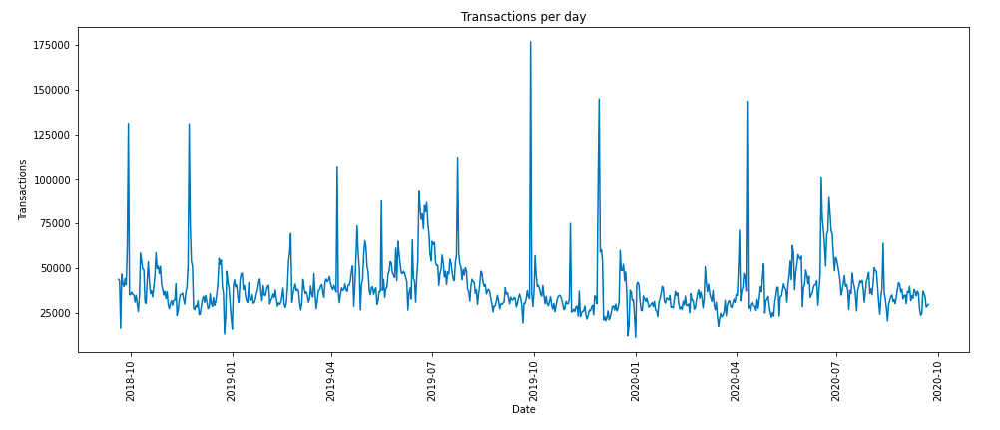

## Clients

El dataset de clients conté informació sobre cada un dels clients. En particular, per a cada consumidor hi ha la següent informació:

| customer_id             | Identificador del client                                                          |
| FN                      | Informació sobre si el client rep *Fashion News*                                  |
| Active                  | Informació sobre si el client rep comunicació de les revistes de moda             |
| club_member_status      | Informació sobre l'estat del *Club Member Status*                                 |
| fashion_news_frequency  | Informació sobre la freqüència en la que el client mira les notícies de moda      |
| age                     | Edat del client                                                                   |
| postal_code             | Codi postal del client                                                            |

El dataset és bastant complert i no hi ha cap variable que requereixi una transformació destacable.  

A continuació, visualitzem alguna representació gràfica de les dades a estudiar, i en destaquem les observacions més interessants.

En primer lloc, representem gràficament la quantitat de transaccions per dia, per veure com es comporta el nombre de compres al llarg del període de temps (el canal 1 representa el canal físic, el 2 l'*online*)

Representem ara, la proporció de transaccions que es realitzen de manera física o *online*:

Finalment, observem les diferències significatives del nombre de compres a les botigues físiques i el nombre de compres en línia al llarg del temps:

