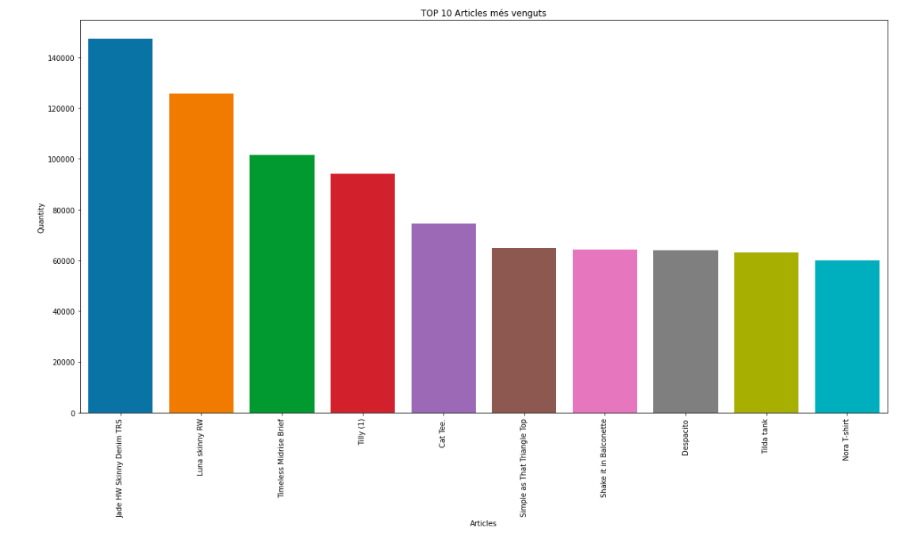

## Relacions
En aquest apartat observem alguna relació interessant que ens aporta el fet d'estudiar de manera conjunta els conjunts de dades.

### Articles i transaccions
Veiem gràficament les observacions més interessants de l'estudi conjunt dels datasets d'articles i transaccions. 

En primer lloc, representem quins són els 10 articles més venguts:

A continucació, quins són els tipus de productes més venguts:

Finalment, quins són els colors més venguts:

