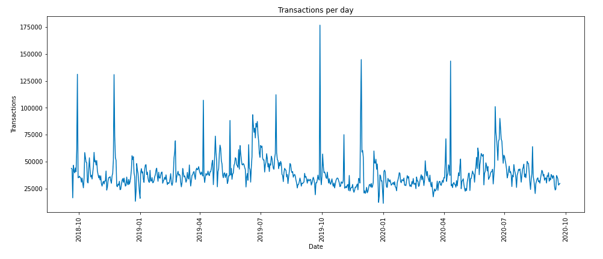

## Transaccions
El conjunt de transaccions conté informació sobre un historial de compres. En particular, per a cada transacció hi ha la següent informació:

| t_dat             | Data de la transacció                                                             |
| customer_id       | Identificador del client que ha realitzat la compra                               |
| article_id        | Identificador de l'article que s'ha comprat                                       |
| price             | Preu de la transacció                                                             |
| sales_channel_id  | Canal mitjançant el qual s'ha realitzat la transacció (botiga física o *online*)  |

El dataset és bastant complert i no hi ha cap variable que requereixi una transformació destacable.  

A continuació, visualitzem alguna representació gràfica de les dades a estudiar, i en destaquem les observacions més interessants.

En primer lloc, representem gràficament la quantitat de transaccions per dia, per veure com es comporta el nombre de compres al llarg del període de temps: 

